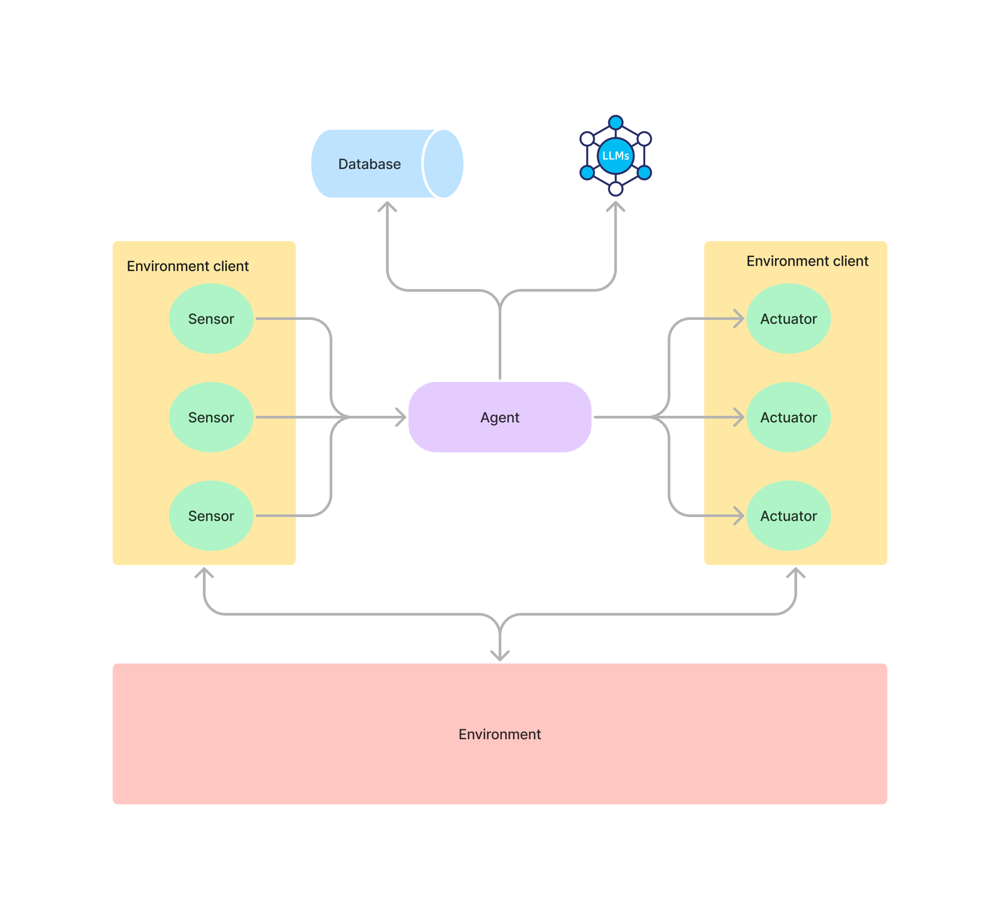
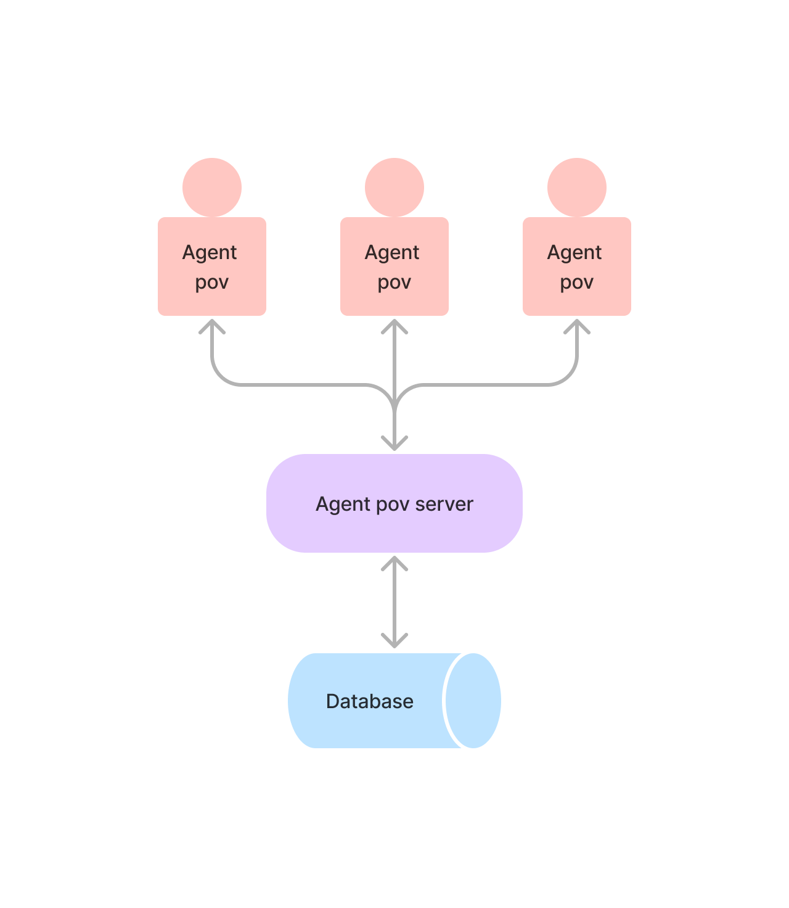

# Evolutionary GPT Agent

## Run the agent
```
docker-compose up --build -d
```

This command spins:

- a deliveroo instance
- a deliveroo client (as explained in the following section)
- a database for experiment tracking
- a webapp for the agent's point of view
- a FastAPi server to serve the agent's POV (as explained in the following section)

## Agent architecture
The agent is composed of two main components (two separate docker containers):

- the agent running the BDI loop and fetching the LLMs, it also saves all the information inside a postgres database (executed in a separate container).
- the environment client that acts as a middleware between the agent and the environment. For each environment a new client has to be written. This allows to reuse the same agent across different environments.



## Agent POV architecure
The database populated by the agent can then be used to monitor one experiment or compare multiple of them.

One python FastAPI server serves all the information required by the user thorugh a React webapp.



## Database
All migrations are applied by default when `docker-compose up` is run, this is done to prevent having an outdated database

**Create a new migration**

```bash
python devc.py new-migration <name>
```

**Run newest migration**

```bash
python devc.py upgrade
```


**Undo last migration**
```bash
python downgrade
```

## Frontend
### Hot reloading
When running all services with `docker-compose`, hot reloading is really slow (can take up to 10-20 seconds).
For development, and exploit fully `vite`'s hot reload avoiding using containers is suggested:

- `docker-compose up -d agent_pov_server db && cd agent-pov && npm run dev`


## Deps
```bash
python3.10 -m venv .venv
source .venv/bin/activate
pip3.10 install .
```

### Pre-commit
```
pip3.10 install ".[pre-commit]"
pre-commit install
```

### Dev
```
pip3.10 install ".[dev]"
```
